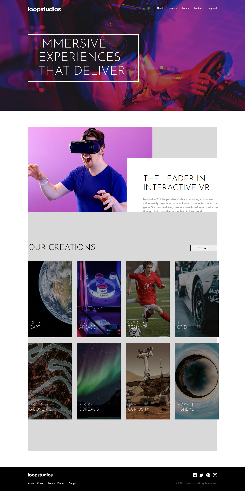
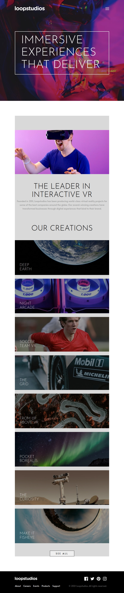

# Frontend Mentor - Loopstudios landing page solution

This is a solution to the [Loopstudios landing page challenge on Frontend Mentor](https://www.frontendmentor.io/challenges/loopstudios-landing-page-N88J5Onjw). Frontend Mentor challenges help you improve your coding skills by building realistic projects. 

** Technologies used

- Semantic HTML5

- Modular SCSS with layered architecture (@use, @forward)

- Responsive design (clamp(), media queries, object-fit)

- JavaScript for menu interaction

- Accessibility best practices (alt, roles, focus).

- Use of picture for responsive images

** Functionalities
- Adaptive design from mobile to desktop.

- Background with ::before and filters to darken images without position: fixed

- Animated mobile menu with visibility control.

- Custom hover animations on navigation items.

- Screen size optimized images (<picture> + source)

-Translated with DeepL.com (free version)

### Screenshot

Add a screenshot of your solution. The easiest way to do this is to use Firefox to view your project, right-click the page and select "Take a Screenshot". You can choose either a full-height screenshot or a cropped one based on how long the page is. If it's very long, it might be best to crop it.

Alternatively, you can use a tool like [FireShot](https://getfireshot.com/) to take the screenshot. FireShot has a free option, so you don't need to purchase it. 

Then crop/optimize/edit your image however you like, add it to your project, and update the file path in the image above.

**Note: Delete this note and the paragraphs above when you add your screenshot. If you prefer not to add a screenshot, feel free to remove this entire section.**

### Links

- Solution URL: [Add solution URL here](https://github.com/rf1303/Loop-Studios-Landing)
- Live Site URL: [Add live site URL here](https://rf1303.github.io/Loop-Studios-Landing/)

## My process

### Built with

- Semantic HTML5 markup
- CSS custom properties
- Flexbox
- CSS Grid
- SCSS
- Mobile-first workflow

## Author

- Frontend Mentor - [@yourusername](https://www.frontendmentor.io/profile/rf1303)
- Linkedin - (https://www.linkedin.com/in/ramiro-fernandez-260935125/)  

